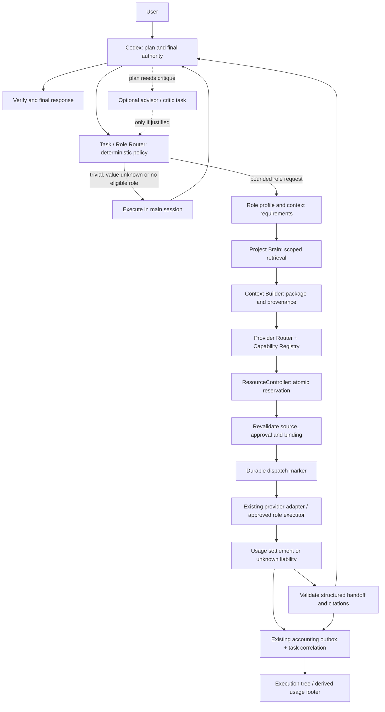

# Role-aware orchestration: minimal extension proposal

Status: ACCEPTED DESIGN ONLY — role runtime deferred until after current Stage 3G. No production change, new framework,
provider call, protocol revision, benchmark execution or Stage 3G closure.

## 1. Decision and evidence basis

Keep Codex as planner and final decision-maker. Add a small deterministic task/role
selection layer **above** the existing delegation boundary. Provider selection stays
inside the accepted execution/accounting pipeline. A role is a bounded responsibility
and permission/context profile, not a provider, process, permanent autonomous agent,
or mandatory step. The best route may always be `main`.

Source audit: main at `23f99f4c3a7b54ac8ced6a25ff7479e0c0a4cedf` (accepted local demo)
and PR #39 at `2064d7f15c6abfe639a9f3d033252fee76e901bb` (reviewed usage correction),
now merged in main at `a55e6f85065b13784903f3cb074a799e360e9f71`.
PR #34 remains separate and open: production classification UNKNOWN, frozen Candidate B
patch, build-007 historical stack overflow, no build-008. This proposal does not change
that work or assert its process/runtime qualification. Stage 3G-C/3G OPEN;
execution_ready=false. The accepted demo is not a paired benchmark or semantic proof.

### Current vs proposed

| Area | Actual repository state | Smallest delta / classification |
| --- | --- | --- |
| Main orchestrator | Codex calls MCP and retains final control | Keep; no replacement planner service |
| Task classification | `delegate.py`: summarize/explain/extract, privacy and configured profile filtering | Partial role selection; add main/role disposition above it |
| Provider routing | `router.py`: deterministic free/local/paid order, exclusions and atomic reserve; `delegate.py`: ordered configured profiles | Exists; keep both scopes explicit, do not add another selector/reservation engine |
| Capability evidence | `registry.py`: expiry, model/context/JSON/task-class evidence; unknown rejected | Exists; later add reviewed role requirements, not vendor bindings |
| Project Brain | `brain.py`, `brain_store.py`: project/worktree/revision/hash-bound FTS5 and revalidation | Exists; role-specific selection views, no second memory database |
| Context | `context.py`, `context_models.py`: ranking, dedup, limits, provenance and immutable packages | Exists; role context requirements feed existing builder |
| Delegation | `delegate.py`, `delegate_server.py`: bounded one-shot MCP delegation; local/cloud runtimes | Exists; no external autonomous coding worker yet |
| Output | `output.py`: summary/citations syntax and source-ID checks; explicitly no tool execution claims | Partial handoff; typed role artifacts/tests/findings need separately reviewed schema |
| Resource safety | Controller, SQLite ledger, reservations/dispatch/settlement, unknown liability, outbox | Exists; reuse for every model/tool attempt |
| Privacy | Cloud export approval and ReleasedPayload; local_only/project_private denied cloud | Exists; role cannot override it |
| Usage | PR #39: derived task summary; off/compact/verbose, known-zero local API charge | Partial execution view; parent/child correlation and coverage missing |
| Benchmark | Frozen fixture/oracle harness and isolation qualification work | No real paired result; role-value evidence missing |
| Advisor/explorer/reviewer | Can be requested as bounded text tasks or performed by Codex | No first-class role profiles/independence validator yet |
| Researcher | Search/extraction is planned in implementation Stage 4 | Missing approved external-tool runtime; do not simulate with model recall |
| Writable worker | Architectural worker handoff and Stage 5 executor design | Missing qualified workspace executor; not implied by delegation success |
| Orchestration tree | Task/reservation IDs and accounting events exist | Missing parent/task dependency lifecycle; add correlation, not another ledger |

Primary references: [architecture](../ARCHITECTURE.md), [contracts](V1_CONTRACTS.md),
[implementation stages](V1_IMPLEMENTATION_PLAN.md), [delegation](STAGE3F.md),
[task usage](USAGE_FOOTER.md). Older broad V1 contracts describe intent; current Python
DTOs define what is executable today. PR #34 future research is not a shipped subsystem.

## 2. Proposed architecture



The diagram separates responsibilities, not a demand for new services. Today
Router.route combines eligible selection with Controller.reserve; retain this
atomic admission rather than inserting a second reserve. Provider-specific exact
request counting/preflight still precedes admission. An advisor is another bounded
role request, not a router or authority above Codex. Trivial path: Codex → answer.

## 3. Task / Role Router contract (proposed, not implemented)

`TaskRoutingInputV1`: project scope; task_id/parent_id; intent and acceptance criteria;
existing task_class; validated features; privacy/export eligibility; context/source
references; risk/complexity; required effect (read/recommend/write); requested effort;
trusted role policy revision; host-issued permission grant reference; remaining
parent budgets; optional reviewed value estimates with evidence/limitations.

Model-produced features are untrusted categorical suggestions. Validate enums,
bounds and consistency; authoritative privacy, permissions, budgets and environment
come from the host. Inputs contain no credentials, arbitrary endpoints, raw quotas
or user-selected sandbox/approval overrides.

`TaskRouteDecisionV1`:
- disposition: `main | delegate | clarify | denied`;
- role: null for main, otherwise approved role ID/version;
- required capabilities/effort, context specification and budget grant reference;
- reason codes, policy hash and evidence references;
- expected benefit dimensions: known/estimated/unknown, never fabricated;
- no provider ticket or resource reservation at this layer.

Invariants: same validated inputs/policy/evidence snapshot → same decision. No
LLM-generated numeric ranking. Main execution is subject to Codex's own permissions;
choosing main never grants additional tools or bypasses a denied DevFabric action.
Unsupported role/tool authority → main where independently allowed, clarify or deny.

### Delegation admission / expected value

First apply hard constraints: privacy, project scope, required effects, capability,
context fit, available quota, permitted monetary cost, deadline, tool authority,
quality requirement and parent budget. FREE → LOCAL → PAID is an eligible-resource
preference, never a privacy override or automatic paid authorization. Private tasks
exclude cloud before ordering. Current profile ordering is trusted configuration;
this proposal does not change it or claim Groq/Gemini/Ollama quality superiority.

Then compare reviewed task-class observations against main: estimated orchestrator
work avoided minus packaging/aggregation/review work; delegated usage/API cost;
expected wall time including queue/startup; failure/rework history; context size and
acceptance reliability. Store ranges/provenance where available. Do not add tokens,
dollars and milliseconds into an arbitrary weighted scalar.

A future approved decision rule can require a positive lower-bound benefit in a
named dimension and no violation of explicit quality/latency/cost ceilings. Freeze
thresholds before evaluation. Unknown baseline or quality does not become positive
expected value. Default to main when value is unknown. Explicit user-directed
bounded delegation remains possible as an authorized action/experiment, without a
savings claim. No automatic exploration or model shopping to fill missing evidence.

## 4. Provider Router contract

Input: existing RouteRequest concepts (project/task/key, exact payload hash,
model-specific input/output bounds, task_class/privacy/JSON requirement) plus validated
role capability requirements, trusted resource policy and approval references.
A trusted provider-specific runtime builds/counts the full request as it does today.
Role and effort IDs never carry provider names or caller-controlled model URLs.

Output: existing RouteResult (selected admission/ticket or no eligible resource,
reason trace); attach selected profile/model/capability revision for observability.
No provider request occurs during role selection. Capability Registry is evidence;
ResourceController is quota/budget authority. Catalog docs remain non-authorizing.

Before-dispatch ineligibility may select another policy-allowed candidate under the
same bounded task; release only a safely unsent hold through existing transitions.
After durable dispatch, automatic backend fallback is forbidden. Task routing cannot
ask another actor to repeat an ambiguous call. Preserve exact model preflight,
revalidation, origin/schema admission and no hidden SDK retries.

Effort is capability demand, not a guarantee that a model supports a named thinking
parameter. A verified adapter may map it to supported knobs in a later reviewed
profile. Unknown support fails eligibility or returns to Codex; do not invent tokens.

## 5. Role definitions and V1 recommendation

All roles receive a minimal task envelope, acceptance criteria, source references,
explicit permissions, budget/deadline and output contract. No role gets full session
history by default. No role may recursively delegate in the initial extension.
Requests for more context, tools or another role return to Codex as proposals.

| Role | Purpose / inputs / context | Tools and effects | Output / termination / skip | Capability, privacy, V1 |
| --- | --- | --- | --- | --- |
| Advisor / critic | Critique a consequential plan, alternatives, assumptions and scoped decisions; only needed evidence | None in first slice; no writes or authority to approve spend | Risks, unsupported assumptions, recommendations, evidence IDs; one bounded response; skip trivial/low-risk plans or redundant critique | Strong reasoning for risk, structured output; private plan stays local; optional template, not mandatory gate |
| Explorer | Find relevant code areas from task, file inventory, selected code/ADRs; no unrelated web history | Initially host-mediated Brain retrieval only; later reviewed read-only path/symbol queries | Ranked paths/symbols with provenance, gaps and confidence limitations; stop at sufficient evidence or budget; skip known exact files | Code reading/retrieval synthesis; same project only; best first role candidate |
| Researcher | Answer a fresh-docs/external question from query, allowed domains and minimal redacted repo constraints | Later approved search/fetch tools; no shell/writes; network/domain policy and SSRF controls | Claims with URL/source hashes, observed dates and limitations; stop after bounded sources/calls; skip repo-local or already verified questions | Source verification and synthesis; queries also pass export rules; defer activation to Stage 4 tool gate |
| Worker | Implement a bounded change from task, acceptance criteria, scoped sources, base revision and approved workspace | No writes in first text-role slice; later isolated branch/worktree RW allowlist and approved command/test profiles | Patch/artifact hashes, changed paths, checks actually run and results, decisions/warnings; stop on acceptance or budget; skip tiny/tightly coupled edits best done by Codex | Coding + test understanding, sufficient context; private code local absent approved export; writable role deferred to Stage 5 executor gate |
| Reviewer | Independently assess diff, requirements, tests, relevant decisions and original evidence | Read-only first; later tests in approved evaluator sandbox, no code mutation | Structured findings (severity/path/line/evidence), unmet criteria, limitations; no finding is not automatic acceptance; stop after scope checklist/budget; skip redundant low-risk review when policy permits | Code reasoning/security as needed; fresh context separated from worker transcript; optional read-only template, final decision Codex |

Advisor critiques the plan; reviewer checks the produced change. They are not two
mandatory calls. Reviewer independence means fresh bounded input, no worker private
reasoning/history and recorded independence level. Same provider/model is not
statistical independence; do not claim it. Worker summary is untrusted and cannot
replace the diff/tests. None of these roles can merge, publish or alter policy.

### Proposed output envelope

Reuse common status/summary/citations/package/accounting concepts. A future separately
versioned `RoleHandoff` adds role/task/parent IDs, outcome (`completed | blocked |
failed | needs_context`), evidence references, artifact hashes and role payload:
- advisor: risks, assumptions, recommendation;
- explorer: paths/symbols and source IDs, missing evidence;
- researcher: claims, supporting source IDs/URLs and observation timestamps;
- worker: base commit, patch hash/paths, checks with actual exit/status, warnings;
- reviewer: findings and acceptance checklist, check provenance and independence.

Do not widen today's ProviderOutput silently: it currently supports only summary /
citations and explicitly disallows claiming tool execution. First read-only templates
can use that existing contract; richer outputs and effectful executors require a
reviewed schema version. Unknown tests, semantics and costs stay null/not_run.

## 6. Context access matrix

| Context source | Main | Advisor | Explorer | Researcher | Worker | Reviewer |
| --- | --- | --- | --- | --- | --- | --- |
| User intent / acceptance | Full authorized task | Plan-relevant subset | Search objective | Research question | Bounded task | Task + acceptance |
| Repo code | Authorized | Necessary excerpts | Approved retrieval scope | Minimal released excerpts | Approved edit/dependency scope | Diff + necessary original code |
| ADRs/conventions | Selected | Relevant constraints | Relevant map | Only relevant public/released facts | Relevant conventions | Relevant decisions |
| Session history | Host-owned | Selected decisions only | None by default | None by default | Selected decisions only | None by default |
| Worker output | Aggregates | Only when asked | None | None | Own artifacts | Diff/artifacts; no private reasoning |
| Web history | Host policy | None by default | None | Scoped sources only | Selected relevant docs | Selected cited evidence |
| Secrets / other projects | Approved secret boundary only | Never | Never | Never | Never | Never |

Brain remains shared durable evidence, not a shared prompt. Context Builder accepts
role-specific required/allowed sources and budget, then applies the existing within-
query ranking, authority, dedup, compaction and provenance rules. Keep selected-context
proxy distinct from exact provider input counting. Essential instructions cannot be
silently truncated. Revalidate each package/source before dispatch; failed freshness
returns context_insufficient/stale, not synthetic replacement facts.

## 7. Permissions matrix

| Authority | Advisor | Explorer | Researcher | Worker | Reviewer |
| --- | --- | --- | --- | --- | --- |
| Read supplied package | Yes | Yes | Yes | Yes | Yes |
| Read additional repo | Host-approved selection only | Approved read-only paths | Minimal release only | Approved dependency paths | Approved diff/context paths |
| Write code | No | No | No | Later: explicit disposable workspace grant | No |
| Run commands/tests | No | No initially | No | Later: reviewed sandbox profiles | Later: read-only inputs, disposable test outputs |
| Network tools | No | No | Later: scoped search/fetch | Denied by default | Denied by default |
| Direct credentials / Docker socket | No | No | No | No | No |
| Merge/publish / change policy / approve paid | No | No | No | No | No |
| Spawn/delegate | No | No | No | No | No |

Provider-network traffic belongs to the host adapter, not arbitrary role network
access. A future workspace grant binds project/root/base revision, path allowlist,
commands, egress, deadline and resource limits. Resolve symlinks/escapes and forbid
writes to main, state, ledger, secrets and sibling worktrees. No raw arbitrary shell
permission just because role=worker. Prompt injection cannot change these grants.

## 8. Decision Fork and effort tiers

A Decision Fork is a recorded local choice point, not automatically an agent/node
or inference. Record type, candidates, policy version, selected alternative, reason
and evidence only when relevant; do not create verbose traces for every instruction.

| Choice | Default owner | When a model is justified |
| --- | --- | --- |
| Which file | Exact path/symbol + Brain rank heuristic | Codex interprets genuinely ambiguous evidence; bounded explorer only if valuable |
| Which tool | Deterministic capability/permission allowlist | Model may suggest an intent; policy still authorizes |
| Retry vs stop | Existing dispatch/accounting state machine | Never delegate the authority to retry ambiguous sends |
| Delegate vs main | Deterministic constraints/value gate, Codex final choice | Optional structured feature extraction, reused from existing reasoning; no mandatory call |
| Provider fallback | Existing pre-dispatch eligibility only | Model cannot authorize post-dispatch fallback or paid use |
| Raise effort | Risk/ambiguity policy + Codex decision within grant | A new bounded attempt only with authorization; no hidden retry |
| Missing plan alternative | Codex | Optional advisor for costly/high-risk uncertainty |

A separate cheap model decision call is exceptional: categorical ambiguity remains
after deterministic metadata/retrieval, a reviewed policy expects its decision value
to exceed the extra call cost/latency, and an explicit call/context/deadline budget
exists. It returns validated features, not authority or arbitrary scores; account it
as a normal bounded call. Security/privacy/retry/paid decisions are never delegated
to it. Otherwise use a local heuristic or Codex's already-active reasoning.

LOW: deterministic/metadata decisions need no model at all; simple extraction needs
verified text/structured-output capability. MEDIUM: bounded exploration/research/code
needs relevant context and domain/tool capability. HIGH: architecture, critical review
or ambiguous debugging may require stronger reasoning and independent verification.
All tiers are vendor-neutral. No automatic HIGH escalation loop and no claim that
HIGH guarantees correctness. Complexity is not itself a reason to delegate.

## 9. Execution lifecycle and failure handling

1. Codex identifies task scope/acceptance; direct answer is the default short path.
2. Host validates task features, project/privacy/permissions and parent ceilings.
3. Deterministic Task Router selects main or one bounded role, recording rationale.
4. Host builds role context through Brain/Context Builder; cloud requires an explicit
   ReleasedPayload with the existing release/provenance approval. No role auto-redacts.
5. Existing trusted profiles, provider preflight, Registry/Router/Controller admit the
   eligible resource and durable hold. No stale resource snapshot grants capacity.
6. Revalidate package, model, permission/origin/schema/runtime binding; commit dispatch
   before send. The unfinished Stage 3G origin proof remains a prerequisite where used.
7. Execute one bounded attempt. Capture complete usage even when output is invalid;
   settle or retain unknown_usage using the existing controller/outbox.
8. Validate schema/citations/artifact scope separately from semantic acceptance.
9. Return compact handoff to Codex; Codex verifies/aggregates and decides final response.
   Only trusted acceptance workflow may label semantic success or apply a patch.

Proposed initial delegated node ceilings: max provider sends=1, child delegation=0,
no automatic rerun. Context/output/deadline use the reviewed existing profile limits;
parent budgets must explicitly cap total nodes/calls/time/tokens/API spend. No unlimited
loops on free providers. The first implementation can be sequential; parallel branches
and atomic parent-budget allocation are later reviewed work, not implicit counters.

| Failure boundary | Action |
| --- | --- |
| Missing context / unsupported role / denied privacy | No send; main/clarify/deny; request extra context via Codex |
| Provider ineligible before dispatch | Existing policy may try next eligible candidate within attempt ceiling; no cost/quality claim |
| Definitively unsent error | Existing safe release; return control; a new attempt needs explicit policy |
| Timeout/disconnect after dispatch, crash with uncertain send | unknown_usage; no release-to-zero, no retry/cross-provider resend; reconciliation required |
| Full usage but malformed output/citation | Settle usage, mark validation failure; Codex decides repair/new bounded task |
| Worker workspace conflict or stale base | Do not auto-apply/merge; preserve patch artifact and return conflict |
| Budget/deadline/cancel after send | Stop new work, preserve liability; cancellation is not proof of no execution |
| Semantic uncertainty | Report unknown/failed acceptance, not success; main review or explicit escalation |

New attempts receive linked distinct attempt IDs and host authorization, not a new
request key to evade replay/quota rules. Parent cancellation blocks new children;
completed/ambiguous accounting survives process restart. No autonomous recursive loop.

## 10. Execution tree and observability contract

Proposed `ExecutionNodeV1` (data contract only):

```text
schema_version, node_id, parent_id, dependency_ids, project_scope_ref
role_id, role_version, disposition, effort_requirement, policy_hash
context_package_hash, source_snapshot_ref, permission_grant_ref
state: planned | denied | running | completed | failed | unknown | cancelled
attempt_refs[]: request_key, reservation_ref, accounting_event_refs
observed_provider, observed_model, capability_revision
start_at, end_at, wall_ms, provider_latency_ms
usage_ref, baseline_ref, cost_ref
output_validation, citation_validation, semantic_acceptance
artifact_refs[]: kind, hash, scoped location
failure_reason, retry_observation, fallback_observation, independence_level
```

Unknown fields are null; planned provider is distinct from observed provider. A denied
candidate is not an executed edge. Every task gets one parent (tree); dependency_ids
allow reviewer-after-worker relationships without duplicating nodes or token counts.
Main-session usage is unknown unless host telemetry supplies a verified observation.
No prompts, credentials/fingerprints, private payloads or unnecessary account IDs in
the tree. Redacted scoped artifact references stay local by default.

Illustrative future view, **not current measured execution**:

```text
Main (Codex)
├── Explorer [observed provider/model or unknown]
├── Researcher [observed provider/model or unknown]
├── Worker [observed provider/model or unknown]
└── Reviewer [depends on Worker; independent-context status]
    → Main verifies final result
```

Reuse existing task/reservation/event IDs. Add orchestration correlation/lifecycle
metadata in the existing SQLite state with a reviewed migration only when implementing;
keep AccountingEvent v1 and its transactional writes unchanged. A new orchestration
event type may reuse the outbox export pattern, not masquerade as a settled charge.
Do not duplicate usage/quotas or make a parallel benchmark store. Initial renderer
can derive a tree from a bounded task manifest joined to authoritative events.

Aggregation deduplicates by attempt/reservation, not parent+child sums. Keep Codex,
delegated input/output and cached subsets separate; report observed subtotals with
coverage when some nodes are unknown. Root elapsed time is not summed child latency
for parallel work. Costs preserve measured/known_zero/estimated/unknown taxonomy;
local known-zero API charge does not price energy/hardware. Whole-response saving
requires a comparable whole-response baseline, never the sum of per-node percentages.
Quality remains separate from transport/accounting/schema success. Feed a future
versioned aggregate into UsageSummary rather than changing the accepted task view's
route_complete=false or fabricating Codex counters.

## 11. Minimal implementation slices and V1 vs later

Here V1 means a **future role extension**, not reopening accepted Stage 1–3F or
changing the frozen Stage 3G experiment. Review and complete qualification/benchmark
work before activating a changed orchestration strategy in measured runs.

1. **Now: design only.** Approve vocabulary, invariants, role permission/context tables
   and default-main behavior. No new runtime components.
2. **Only after current Stage 3G completes and separate implementation approval:**
   static RoleProfile table, TaskRouteDecision DTO and deterministic policy tests.
   First executable slice: main + explorer only. Advisor/reviewer are later optional
   slices, not part of the initial activation. No model role-classifier,
   new worker process, recursive calls or public MCP schema widening by default.
3. **Observability slice.** Parent correlation + bounded manifest/tree projection,
   outbox-compatible lifecycle records; preserve current task usage semantics.
4. **Separate strategy evaluation.** Explicitly reviewed new frozen comparison after
   current Stage 3G, not modifying fixtures or mixed configurations mid-run. Measure
   quality, orchestrator resources, latency, calls and rework before default adoption.
5. **Later existing Stage 4/5 work.** Researcher only after search/export/SSRF gates;
   writable worker only after sandbox/workspace/artifact/test gates. Role-specific
   output schemas and reviewer test execution require review.
6. **Later, if evidence warrants.** Bounded parallelism, independent reviews for risk,
   Strategy Registry beyond a static table, optional paid capabilities. Parent resource
   budgets/concurrency must be atomic; child roles still cannot elevate authority.

## 12. Exact candidate repository change map (future; no edits here)

| File | Future reason / constraints |
| --- | --- |
| `src/devhub/roles.py` (new) | Static role/capability/context profile DTOs; avoid dynamic plugin registry |
| `src/devhub/task_router.py` (new) | Pure main/role decision, reason/evidence, no provider I/O or reserve |
| `src/devhub/delegate.py` | Thin integration after reviewed DTO versioning; retain existing runtime path |
| `src/devhub/delegate_server.py` | Only if a reviewed role request is exposed; input-schema hash/origin policy re-review required |
| `src/devhub/context_models.py`, `context.py` | Role context constraints reuse current builder; no memory rewrite |
| `src/devhub/registry.py`, `router.py` | Only genuinely missing verified capability requirements; preserve reservation atomicity |
| `src/devhub/output.py` | Separately versioned role handoffs, never silently alter current ProviderOutput |
| `src/devhub/ledger.py`, `events.py` | Reviewed parent/lifecycle correlation migration only; no second accounting ledger |
| `src/devhub/execution_tree.py` (new) | Projection/coverage/dedup, not a source of monetary truth |
| `src/devhub/usage.py`, `usage_render.py` | Optional future aggregate/tree view, preserve current task scope/default off |
| `tests/test_task_router.py`, `test_roles.py`, `test_execution_tree.py` (new) | Determinism, permissions, default-main, limits, unknowns, tree dedup |
| `tests/test_delegate.py`, `test_usage.py` | Existing-path compatibility and no semantic/savings overclaim |
| `ARCHITECTURE.md`, `docs/V1_CONTRACTS.md`, `docs/V1_IMPLEMENTATION_PLAN.md` | Link reviewed delta and distinguish deployed vs proposed roles |
| `docs/SECURITY.md`, `docs/STAGE3F.md`, `docs/USAGE_FOOTER.md` | Role grants, delegation compatibility, tree scope/provenance |

Do not modify frozen protocol/evidence, fixture/oracle bytes, provider runtime or
production Codex patch for this proposal. A future changed MCP schema cannot reuse
the currently approved schema hash; that is an explicit gate, not an incidental edit.

## 13. Required future tests / risks / recommendation

Tests before activation: trivial task chooses main with zero auxiliary sends; exact
same inputs choose same role/provider; privacy cannot be weakened by features/role;
read-only roles cannot write; children cannot escalate/delegate; stale context denied;
source-ID validation; pre/post-dispatch failure semantics and replay invariants;
parent budgets cannot oversubscribe; untrusted tool output cannot alter permissions;
reviewer independence metadata truthful; aggregate unknowns and costs not flattened;
no duplicate accounting; old requests/defaults unchanged.

Risks: advisor/reviewer tax, repeated context packaging, model grading itself,
artificial independence, parallel quota races, prompt injection across roles,
workspace collisions, cache/source drift, unpriced local work and inflated savings.
Each optional stage needs measured benefit; more agents is not more correctness.

**Implement now:** this proposal/review artifact only. The minimal future code delta
is a static role policy and pure Task Router over the existing delegation core.
**Defer:** automatic role activation until evaluation, browser/web research tooling,
writable workers, recursive/multi-agent loops, parallel orchestration, richer role
schemas, parent-budget storage and independent-review automation to reviewed slices.
**Reject:** mandatory five-role chains, opaque LLM scores, per-role memory databases,
new gateways/ledgers, global tool exposure, unsafe fallback, automatic paid escalation,
and adding LangGraph/CrewAI/Redis/Qdrant without an evidenced requirement.

Final recommendation: preserve direct Codex execution as the default. Introduce roles
as small, optional context/permission contracts; select providers independently and
reuse the current safety/accounting path. Demonstrate value before making any role
part of the normal workflow. No implementation is authorized by this document.

## 14. Accepted sequencing and clarification (PR #40 review)

Role architecture design is ACCEPTED. Role runtime implementation is DEFERRED UNTIL
AFTER CURRENT STAGE 3G. No runtime slice, including an offline task router, is being
implemented now. Current production admission/dispatch qualification comes first,
then the current frozen A/B evidence. Roles cannot enter that measured workflow.

RoleProfile = bounded task contract + allowed context + allowed effects + capability
requirements + output contract + budgets. It does not inherently create a process,
model, provider, memory store or agent loop. Explorer can use existing one-shot
execution. Do not introduce process-per-role infrastructure.

The future pure route_task(input) returns main/delegate/clarify/denied. It performs
no inference, network/provider probe, reservation or ledger mutation. Where needed,
consume only a trusted abstract capability/resource availability snapshot:
validated task → hard policy/privacy → role eligibility → available capability
classes → main or bounded role → existing provider admission. A stale snapshot
cannot authorize quota; ResourceController still performs actual atomic admission.

First eventual role: explorer with bounded query, allowed project/source classes,
context budget; ranked paths/symbols, evidence IDs, missing evidence and limitations.
No commands, web, writes, child delegation or new worker process. Advisor critiques
plans; reviewer checks produced results. Neither is a mandatory sequential step.
Reviewer independence records factual same_context/fresh_context/different_provider/
different_model observations, not a claim of statistical independence.

Researcher remains gated on Stage 4: domain allowlist, SSRF/redirect controls,
download/content limits, injection treatment, provenance/observation dates and
privacy/export review. Model memory is not external research. Writable worker stays
behind Stage 5 workspace authority (project/base/worktree/path/command/network/time/
resource limits), with no Docker socket, arbitrary host shell, secrets, main/state/
ledger/sibling writes, automatic merge or push.

ExecutionNode remains future derived orchestration metadata, reusing task/request/
reservation/event/package IDs and authoritative usage. No second accounting store.
Dedupe attempts; separate Codex/delegated/cached counters; preserve unknown children;
parallel duration is not summed wall time. Whole-response savings requires a
whole-response baseline. Current UsageSummaryV1 remains delegation_task with
route_complete=false; tree coverage requires a separately reviewed extension.

Decision Fork does not inherently create an agent/call/node. Unknown benefit selects
main unless explicitly running a reviewed experiment. Keep quality, latency, cost
and lower-bound benefit separate with thresholds frozen before evaluation. Strategy
Registry, recursive loops and generic frameworks remain future-only.

Executable delegation and frozen fixtures/oracles/protocol remain unchanged. PR #34
remains UNKNOWN / Stage 3G-C OPEN / execution_ready=false. Build-007 compile/baseline
PASS, adversarial stack overflow after prepared_execution_entered, root cause UNKNOWN.
Candidate B patch remains frozen; build-008 NOT RUN. No v3, rehearsal or benchmark.
