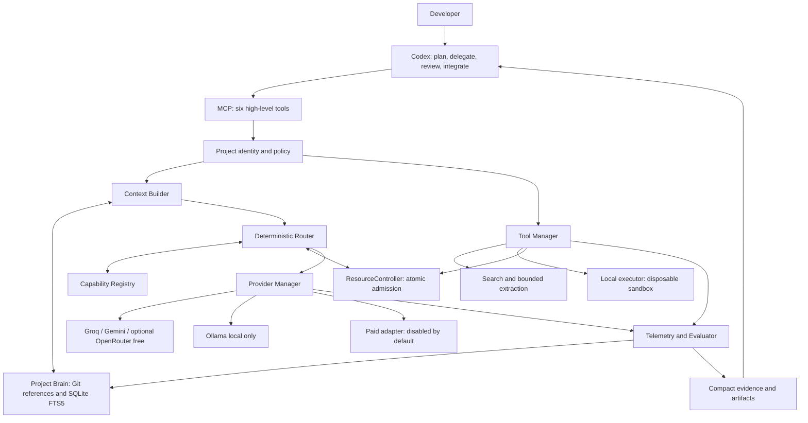

# V1 technical proposal

Status: **Proposed, design only**. Date: 2026-09-28.
Baseline, evidence and gaps: [audit](V1_AUDIT.md), [research](V1_RESEARCH.md).
Normative field definitions: [contracts](V1_CONTRACTS.md).

## 1. Executive decision and V1 stack

Build one local, single-user Python service providing a small MCP toolbox to
Codex. Codex retains planning, delegation choice, review and final integration.
Use Python 3.12, official MCP SDK v2 (exact tested patch locked in Stage 1),
Pydantic v2 validation, httpx transports, SQLite/FTS5, Git and ripgrep. Use pytest
with deterministic clocks/fake adapters, Ruff and a type checker for verification.
No web UI, distributed queue, Redis, vector database or general agent framework.

Initial adapter sequence: Groq, Gemini, Ollama, then opt-in OpenRouter free.
One Tavily search adapter plus bounded HTTP extraction provides research.
Paid inference uses one explicitly configured OpenAI-compatible adapter only
after policy tests; disabled by default. No Codex subscription credentials are
reused as API credentials. Docker Compose packages the service; a separate local
executor launches disposable sandbox containers. Do not start every optional
service with the core.

All mandatory V1 core components are modules in this service, not microservices.
V1 includes bounded model workers and sandboxed test execution. Cursor/OpenHands
product adapters remain later: neither is required to prove V1 delegation value.
The catalog is preserved, including graph memory, multimodal and workflow ideas.

Dev Hub helps develop applications. `ai-platform` provides runtime/API to finished
applications. No imports, shared DB, required API dependency or repository changes
connect the two. Existing projects need only external registration of a root and
permissions; no rewrite or injected runtime package.

## 2. Component diagram

Every external operation, including search, shares the admission and telemetry
path. Registry describes capabilities; ResourceController decides affordability;
Router ranks eligible resources. None decides whether Codex must delegate.

## 3. Data flow and ownership

1. Codex either works directly (A baseline) or submits a bounded task (B). Hub
   never intercepts all Codex reasoning or mirrors its conversation.
2. Authenticate the local caller, resolve registered project, check policy,
   idempotency key, revision and requested scope before any lookup or egress.
3. Context Builder selects sources, classifies privacy, redacts known secrets,
   records hashes and estimates prompt size. No external summarizer is used to
   decide whether content may leave the host.
4. Router filters capability/privacy/quality/deadline; ResourceController checks
   context, quotas, money and local capacity. Router chooses a candidate.
5. Rebuild context for that model's actual budget, then atomically reserve all
   applicable resources. Stale selection causes re-evaluation, not overcommit.
6. Adapter dispatches exactly one attempt with a timeout/output bound. Only the
   core owns retries and fallbacks. Provider-side hidden retry costs are marked
   unknown unless measurable; adapter policies minimize such behavior.
7. Validate shape and evidence, account for actual/uncertain usage, persist event
   and artifacts. Invalid JSON is a failed attempt, not success. A repair attempt
   consumes the same total task budget and attempt limit.
8. Return a compact result. Codex may accept, reject or redo it and records the
   outcome. Code patches are artifacts; Codex applies/integrates them explicitly.

Default task limit: 3 total inference attempts, 120 seconds overall, no unbounded
worker loops or nested delegation. Exhaustion returns `no_eligible_resource`,
`deadline_exceeded`, or `needs_approval`; it never silently enables billing.

## 4. MCP and provider boundaries

Expose `devhub_status`, `devhub_delegate`, `devhub_research`, `devhub_context`,
`devhub_remember`, `devhub_sandbox`. Contracts cover submission, polling and
cancellation without adding provider-specific tools. Read-only annotations are
descriptive; server authorization is authoritative. Provider API keys and raw
responses do not appear in the MCP schema.

ProviderAdapter supports capabilities, health, quota, estimate and execute.
Native APIs may preserve information lost by OpenAI-compatible shims. Claim only
the tested capability subset. A model producing tool calls does not gain tool
execution rights; model workers return data/patches in V1. Tools and external
agents use separate adapters behind the same admission/policy envelope.

The [research](V1_RESEARCH.md) compares gateways across maintenance, license,
hosting, complexity, performance, API/OpenAI/MCP compatibility, observability and
replacement. Minimal adapters win at this scope, with explicit upkeep risk.

## 5. ResourceController

Admission uses one persistent SQLite ledger with short `BEGIN IMMEDIATE`
transactions. Do not hold a DB transaction across network I/O. Account/organization
quota pools can span projects and models; key rotation creates no new capacity.
Separate per-project data from a global, metadata-only account ledger.

Track input, selected-context subset, output/reasoning allowance, request count,
RPM/TPM/RPD/TPD, arbitrary provider units, daily/monthly/rolling windows, known
reset times and free reserve. Context tokens are part of input, not an extra
charge. Reserve conservative maximum output, not only expected output.

For each window, admit only if `used + pending + requested <= limit - reserve`.
Also require observed remaining minus locally unreflected consumption to cover
the request. Record snapshot watermarks to avoid counting reconciled requests
twice. When clocks or external usage are uncertain, use the stricter bound.
Free reserve defaults to 10% of renewable capacity; it does not reserve RPM for
hours. Policy may define distinct per-window reserves.

Paid admission atomically reserves worst-case integer micro-USD at task,
project/day and global/month scopes, including request/tool fees and taxes where
applicable to account estimates. Unknown pricing or uncapped ancillary charges
deny automatic paid dispatch. A hard Hub cap cannot control calls made elsewhere
with the same credential; use dedicated credentials/provider-side caps where
available. Never equate a Hub estimate with the provider invoice.

Reservation states: `reserved -> dispatched -> settled`, or `released` before
dispatch; uncertain dispatched work becomes `unknown_usage`. A crash after send
retains liability until reconciliation/window expiry, not lease timeout alone.
On restart, inspect expired leases and dispatch markers before retries. Metering
uncertainty must not be converted to zero. At-most-once local submission is
enforced by project + idempotency key + payload hash; network exactly-once is not
promised. Ambiguous paid executions do not auto-retry.

429 updates the relevant pool/reset hint; use bounded jitter and Retry-After.
401/403 disables the credential/entitlement; 404 invalidates model metadata;
5xx affects health, not necessarily quota. Circuit opens after 3 transient
failures, cooldown 60 seconds, one half-open probe. These are initial policy
defaults, not facts about provider limits. Unknown reset time stays null; never
assume midnight UTC. Persist UTC deadlines, use monotonic time for durations.

Local resources: record installed model digest, effective context, RAM/VRAM
observations when available, queue depth, concurrency and load time. Default one
local inference at a time; unavailable metrics use conservative serial admission.
No automatic model download. OOM opens local circuit and returns a failure.

## 6. Registry and routing model

Registry state is model + endpoint + plan + version-specific; `supported`,
`unsupported`, and `unknown` are distinct. Documentation supplies assertions,
probe evidence supplies verification and expiry. Unknown required capability is
ineligible. Runtime health/quota is joined from ResourceController, not duplicated
as an independent source of truth.

Routing v1 is deterministic:

1. Reject unauthorized project/privacy, stale essential metadata, unsuitable
   capabilities/context, failed quality gate, excessive deadline estimate,
   exhausted quotas/budgets and unhealthy/unavailable resources.
2. Within eligible resources prefer renewable free cloud, then local, then paid
   if allowed. Credits/evaluation classes require explicit class enablement;
   trials are off by default. Privacy can force local before any cloud attempt.
3. Within a tier, use a configured task-class allowlist/order established by the
   benchmark. Break ties by measured p95 latency, reserve-adjusted headroom,
   expected cost and stable resource ID. Unknown quality uses the evaluation
   lane only; no invented confidence score.
4. Log candidate exclusions and the selected policy version. If no option fits,
   abstain. Codex can finish directly.

Historical accepted/rejected/reworked results can quarantine a route after review;
there is no online bandit, automatic prompt optimizer or learned routing in V1.
Latency/quality overrides require recorded policy reasons. Do not spend repeated
free attempts merely to maintain free-first appearances.

## 7. Context Builder and repository retrieval

Inputs are task, scope, acceptance criteria, project revision and retrieval
query—not full repo/history. Read registered roots using Git's tracked-file list,
ripgrep identifier/path matches, FTS5 over approved documentation and excerpts,
then bounded neighboring definitions. Exclude binaries, ignored/generated/vendor
files, credentials and private paths. No automatic dependency installation.

Rank exact paths/symbol hits, task-relevant ADRs/conventions, then lexical matches
and selected summaries. Deduplicate overlapping ranges. Preserve path, line range,
Git revision or dirty-file hash and retrieval reason for every excerpt. Check
hashes again before dispatch. Deleted/changed chunks are invalidated; index keys
include project, root identity, branch/worktree, commit, dirty hashes and index
version. Reindexing cannot cross project boundaries.

Initial selected-context cap: 8,000 estimated tokens; response summary cap: 1,500.
Effective context is `min(task cap, model window - max output - safety margin)`
after system/task/tool overhead. Use adapter token counts when available and a
conservative calibrated estimator otherwise. Essential instructions and acceptance
criteria cannot be silently truncated; return `context_insufficient` if they do
not fit. Fallback to a smaller model triggers a new package and admission check.

No vector DB in V1. Add tree-sitter for measured symbol-recall failures, then
embeddings/Qdrant only if a labeled retrieval benchmark justifies them. No semantic
cache until revision, privacy, policy and model identity invalidate it correctly.

## 8. Project Brain storage

Per project: SQLite WAL database, FTS5 index and private artifact directory outside
the target repo. Global DB stores only shared quota reservations/config metadata.
Git remains authoritative for code and checked-in architecture/ADRs. The Brain
stores references and rebuildable bounded excerpts, not an alternative code tree.

Tables: projects/root identities, source_refs, chunks/FTS, decisions, task_summaries,
context_packages, jobs, artifacts and evaluation_outcomes. Detailed keys and
retention appear in the contracts. `remember` is explicit and revision checked.
An unreviewed summary cannot supersede an ADR. Conflicting decisions are returned
with provenance; no automatic overwrite or model-created global fact.

SQLite's single-writer and local-disk assumptions are acceptable for V1. Do not
place WAL on a shared network filesystem or run multiple core replicas. Back up
with SQLite backup API plus artifact manifest; test restore. Indexes can be rebuilt,
accepted decision records cannot. Default raw payload logging off, context/artifacts
7 days, task summaries 30 days, metadata 90 days; durable accepted decisions until
explicit deletion. Remove FTS rows and local artifacts on project deletion; backup
retention must be disclosed separately. Export decisions/summaries as versioned JSON.

## 9. Research, sandbox and worker execution

Research is a bounded DAG: approved query -> basic search -> up to 5 sources ->
safe extraction -> optional routed synthesis -> cited compact result. Budget all
search credits and synthesis attempts together. No provider means `unavailable`,
not invented citations. V1 has no interactive browser/crawler installation.

Sandbox accepts named command profiles and validated arguments, not arbitrary
Docker flags or a free-form host shell. Create an isolated Git worktree/snapshot;
mount it into a non-root container. Enforce 2 CPU, 2 GiB memory, 128 processes,
120-second default deadline, capped output, read-only root filesystem and writable
temporary workspace only. Drop capabilities; no privileged mode; default seccomp;
no host PID namespace, devices, home, secrets or Docker socket. Network off.
Profile-specific limits may be lower, never caller-escalated.

Core cannot hold Docker daemon authority. A separate local executor validates
fixed image digests, project/job paths and profile IDs and controls a dedicated
rootless daemon. Its control socket is accessible only to the trusted Hub service;
workers cannot reach it. Windows support targets WSL2 Linux engine with tested
path mapping; Docker Desktop licensing/host constraints require deployment review.
Container escape remains a risk; do not run hostile multi-tenant code in this V1.

Worker input contains task/scope/package/permissions/tests/deadline. Output is
summary, patch reference, changed files, test evidence and warnings. Model worker
does not execute commands itself. Codex can request sandbox validation separately.
No production access, auto-merge, main-branch writes or recursive worker spawning.

## 10. Security model

| Boundary / threat | Required control and verification |
|---|---|
| Caller supplies another project ID | Bind project allowlist to local identity/session before DB lookup; negative tests for guessed IDs |
| Private source goes to free cloud | Effective privacy is the strictest of project/task/source; public/redacted only by default; local-only never falls back to cloud |
| Prompt injection in repo/web/model output | Treat it as untrusted data; cannot change policies, approvals, tools or credential scope |
| Path traversal / symlink escape | Canonical root containment, no following escaping links, race-aware file reads; check artifact export too |
| SSRF through research | HTTP(S) only; reject credentials and private/loopback/link-local/metadata IPs for both IPv4/IPv6; validate DNS/connect address and each redirect; cap size/time/decompression |
| Secret leakage | Credentials resolved inside adapters; redact logs/errors; no secrets mounted into sandbox; detector supplements explicit path/privacy rules |
| Paid escalation by model | Model cannot mint approval. Trusted local policy/approval record binds project/task/route/max cost/expiry, single use |
| Sandbox breakout / artifact attack | Least-privilege executor; deny host mounts; reject symlinks/traversal/oversize exports; treat generated scripts as untrusted |
| Supply chain | Lock hashes/image digests; review license inventory and updates; no `latest` images or runtime package fetching |
| Unsafe downstream MCP server | V1 does not auto-discover/install MCP servers from untrusted content; configured allowlist only |

No network-facing service is required for stdio. A future Streamable HTTP profile
must bind loopback by default, authenticate callers, validate origin/host and
session ownership, and require TLS if remote. Localhost alone is not authentication.

## 11. Telemetry and evaluation

Record route decisions, all attempts (including failures), resource reservations,
observed/estimated usage, cost, queue/provider/end-to-end times, validation results,
retries and later Codex/human outcomes. Trace ID joins the task; attempt ID joins
the bill/quota entry. No prompt payloads by default. Missing Codex token usage is
null with a reason, never a made-up saving. [Benchmark protocol](V1_BENCHMARK.md)
defines paired comparisons and Delegation Value; no result is claimed yet.

## 12. Configuration and deployment

Versioned TOML, unknown fields rejected; secrets referenced by environment name.
Global security ceilings intersect project policy and task limits; task input can
only tighten policy. Config updates validate completely then activate atomically.
Quotas and price snapshots are data with provenance, not hard-coded provider facts.
See the complete illustrative configuration in [contracts](V1_CONTRACTS.md).

Packaging: one locked core image; stdio via `docker compose run --rm -T hub` for
local use, private persistent state volume, read-only registered repo mounts,
explicit egress only for enabled providers/research. Optional Ollama profile or
pre-existing local host runtime; optional executor installed separately. No Docker
socket mounted into core. On Linux configure the host runtime address explicitly;
do not assume `host.docker.internal` exists. Only one Hub instance owns a state
directory; fail startup on an ownership-lock conflict.

Core health checks are local and free; they do not spend inference quota. On
shutdown stop admissions, cancel safe queued work, persist in-flight liability,
flush metadata and dispose sandbox jobs. Recovery reconciles before new paid work.
No Kubernetes, Supabase, Coolify or external telemetry stack required.

## 13. Testing and benchmark strategy

Contract tests cover envelope/schema validation and adapter normalization.
State-machine tests cover concurrent reservations, resets, shared pools, crash
recovery, cancellation, unknown usage and paid caps. Security tests cover the
boundaries above, including cloud-enabled Ollama models and redirects to metadata.
MCP integration tests use a real SDK client plus manual Codex smoke verification.
Sandbox tests execute only controlled fixtures and assert enforced limits.

CI uses fakes and temporary local repositories, no live keys. Live adapter probes
are opt-in, capped and record model/version/plan metadata; do not probe all models.
Tests assert policy outcomes, not private implementation structure. Paired A/B
fixtures precede any adaptive router; Stage 6 measures V1 exit criteria.

## 14. Evolution and risks

Version MCP envelopes and storage schema independently. Additive fields are
compatible; breaking changes require a new schema version. Migration backs up
state, updates a copy, verifies invariants, then activates; failed migrations leave
the old DB usable. Rebuild retrieval indexes rather than migrating derived chunks.

PostgreSQL is justified by multi-user/concurrent-writer demand; gateway adapters
by provider maintenance; vectors by recall evidence; OTel/Langfuse by analysis
needs; VM sandboxes by trust requirements. Cursor/OpenHands get the existing
bounded worker contract only after their CLI/auth/billing contracts are verified.
No premature shared package with ai-platform.

Principal risks: volatile free access, uncertain data policies, undercounted tokens
or external account usage, local hardware shortfalls, shared-kernel sandbox limits,
MCP SDK/client drift and unavailable Codex telemetry. Mitigate through conservative
eligibility, durable reservations, version pins, explicit unknowns, strict defaults
and baseline measurements. If value is negative, narrow task classes rather than
adding infrastructure.

## 15. Design gate

The proposal supplies all requested design areas; it does not assert execution
readiness of real accounts/hardware. The [implementation plan](V1_IMPLEMENTATION_PLAN.md)
defines Stage 1 acceptance and later operational gates. No Stage 1 coding is
included in this documentation change.
